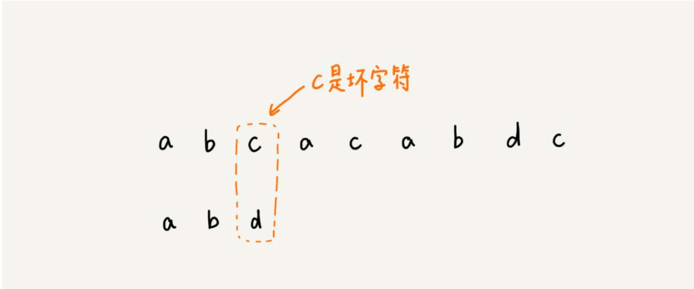
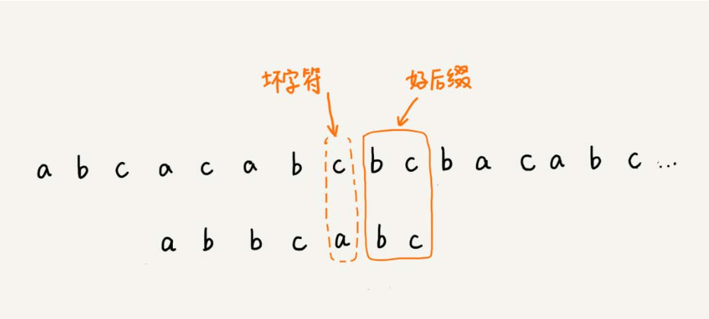

[TOC]

### 字符串匹配

#### 单模式串匹配算法

* 一个串跟一个串进行匹配

##### BF算法

* 暴力匹配算法，也叫朴素匹配算法
* 在主串中，检查起始位置分别是0、1、2……n-m且长度为m的n-m+1个子串，看有没有跟模式串匹配的。
* BF算法的时间复杂度很高，是O(n*m)，但实际开发中，它却是一个比较常用的字符串匹配算法。
  * 实际开发中，大部分情况下，模式串和主串的长度都不会太长。而且每次模式串与主串中的子串配的时候，当中途遇到不能匹配的字符的时候，就可以停止了，不要把m个字符都对比一下。
  * 朴素字符串匹配算法思想简单，代码实现也非常简单。简单意味着不容易出错，如果有bug也容易暴露和修复。**在工程中，在满足性能要求的前提下，简单是首选。(KISS（Keep it Simple and Stupid）设计原则)**

##### RK算法

* 通过哈希算法对主串中的n-m+1个子串分别求哈希值，然后逐个与模式串的哈希值比较大小。若果某个子串的哈希值与模式串相等，那就说明对应的子串和模式串匹配了。

* 由于哈希值是一个数字，数字之间比较是否相等是非常快速的，所以模式串和子串比较的效率就提高了。

  * 哈希冲突——当发现一个子串的哈希值与模式串相等的时候，再对比一下子串和模式串本身

* 通过哈希算法计算子串的哈希值的时候，我们需要遍历子串中的每个字符，尽管模式串与子串比较的效率提高了，算法整体的效率并没有提高

* 哈希算法的设计提高计算时间

  * 假设要匹配的字符串中只包含K个字符，我们可以用一个K进制来表示一个字符串，这个K进制数转化为十进制数，作为子串的哈希值。
  * 这种哈希的特点就是——相邻两个子串是s[i-1]和s[i]（i表示子串在主串中的其实位置，子串长度都为m）,对应哈希计算公式有交集，可以提升计算效率

  

  * 26^(m-1)这部分的计算，我们可以通过查表的方法来提高效率。
    * 事先计算好26^0 、 26^1 、 26^2……26^(m-1)，并且存储在一个长度为m的数组中，公式中的“次方”就对应下标，当我们需要计算26的x次方的时候，就可以从数组的下标x的位置取值，直接使用，省去了计算的时间。

##### BM算法

1. **坏字符规则**

   * 从模式串的末尾往前倒着匹配，当我们发现某个字符没法匹配的时候，这个没有匹配的字符就叫作坏字符（主串中的字符）。

     

     

   * 拿坏字符在模式串中查找，若不存在，模式串直接往后移m位

     

   * 若存在则让坏字符与模式串中匹配的字符上下对齐

     

   * 规律总结——当发生不匹配的时候，将坏字符对应得模式串中的字符下标记作si；如果坏字符在模式串中存在，坏字符在模式串中下标记为xi，若不存在，则记为-1；模式串往后移动的位数就等于si-xi。

   * 若坏字符在模式串中多次出现，计算xi的时候选择最靠后的

   * 根据 si-xi 计算出来的移动位数，有可能是负数，比如主串aaaaaaaaaaaaaa ，模式串是 baaa 。不但不会向后滑动模式串，还有可能倒退。所以， BM 算法还需要用到 “ 好后缀规则 ” 。

2. **好后缀规则**

   

   * 把已经匹配的bc叫作好后缀，记作{u}。拿它在模式串中查找，如果找到了另一个跟{u}相匹配的子串{u*}，就将模式串滑动到子串{u\*}与主串中的{u}对齐的位置

     

   * 如果在模式串中找不到另一个等于{u}的子串，就直接将模式串，滑动到主串中{u}的后面

   * 存在当模式串滑动到前缀与主串中{u}的后缀有部分重合的时候，并且重合的部分相等的时候，就可能会存在完全匹配的情况。

     

   * 针对这种情况，不仅要看好后缀在模式串中，是否有另一个匹配的子串，还需要考察好后缀的后缀子串，是否存在跟模式串的前缀子串匹配。

   * 从好后缀的后缀子串中，找一个最长的并且能跟模式串的前缀子串匹配的，假设是{v}，然后将模式串滑动到如图所示位置

     

* 将模式串中的每个字符及其下标都存在散列表中，这样就可以快速找到坏字符在模式串的位置下标了

  ```java
  public class BM {
  
      private static final int SIZE = 256; //全局变量或成员变量
  
      //b模式串 m模式串的长度 bc表示散列表
      private void genetateBC(char[] b,int m,int[] bc){
          for(int i = 0;i < SIZE; ++i){
              bc[i] = -1; //初始化bc
          }
          for(int i = 0;i < m; ++i){
              int ascii = (int)b[i]; //计算b[i]的ASCII值
              bc[ascii] = i;
          }
      }
  
      //bm算法
      public int bm(char[] a, int n,char[] b, int m){
          int[] bc = new int[SIZE]; //记录模式串中每个字符最后出现的位置
          genetateBC(b,m,bc); //构建坏字符哈希表
          int[] suffix = new int[m];
          boolean[] prefix = new boolean[m];
          generateGS(b,m,suffix,prefix);
          int i = 0;//i表示主串与模式串对齐的第一个字符
          while(i <= n-m){
              int j;
              for(j = m - 1; j>=0; --j){ //模式串从后往前匹配
                  if(a[i+j]!=b[j])break; //坏字符对应模式串中的下标是j
              }
              if(j < 0){
                  return i; //匹配成功，返回主串与模式串第一个匹配的字符的位置
              }
              //这里等同于将模式串往后滑动j-bc[(int)a[i+j]]位
              int x = j + (j-bc[(int)a[i+j]]);
              int y = 0;
              if(j < m-1){ //如果有好后缀的话
                  y = moveByGS(j,m,suffix,prefix);
              }
              i = i + Math.max(x,y);
          }
          return -1;
      }
  
      //j表示坏字符对应的模式串中的字符下标；m表示，、模式串长度
      private int moveByGS(int j, int m, int[] suffix, boolean[] prefix) {
          int k = m - 1 - j; //好后缀长度
          if(suffix[k] != -1)return j-suffix[k] +1;
          for(int r = j+2;r <= m-1;++r){
              if(prefix[m-r] == true){
                  return r;
              };
          }
          return m;
      }
  
      //b表示模式串，m表示长度，suffix,prefix数组先申请好
      private void generateGS(char[] b,int m,int[] suffix, boolean[] prefix){
          for(int i = 0; i < m; ++i){ //初始化
              suffix[i] = -1;
              prefix[i] = false;
          }
          for(int i = 0;i < m -1; ++i){
              int j =i;
              int k = 0; //公共后缀子串长度
              while (j >= 0 && b[j] == b[m-1-k]) { //与b[0,m-1]求公共后缀子串
                  --j;
                  ++k;
                  suffix[k] = j+1; //j+1表示公共后缀子串在b[0,i]中的起始下标
              }
              if(j == -1)prefix[k] = true; //如果公共后缀子串也是模式串的前缀子串
          }
      }
  }
  ```

* BM算法核心思想是，利用模式串本身的特点，在模式串中某个字符与主串不能匹配的时候，将模式串往后多滑动几位，以此来减少不必要的字符比较，提高匹配的效率。

* BM算法构建的规则有两类，坏字符规则和好后缀规则。

  * 好后缀规则独立于坏字符规则使用。因为坏字符规则的实现比较耗内存，为了节省内存，我们可以只用好后缀规则来实现BM算法。

----

1. 要有优化意识
2. 需要查找，需要减少时间复杂度，应该想到散列表
3. 如果某个代表式计算的开销比较的，又需要频繁使用，可以预处理，并缓存

---

##### KMP算法

* 在模式串和主串匹配的过程中，把不能匹配的那个字符叫做坏字符，把已经匹配的那段字符叫做好前缀

* KMP算法就是在试图寻找一种规律，在模式串和主串匹配的过程中，当遇到坏字符后，对于已经比对过得好前缀，能否找到一个规律，将模式串一次性滑动很多位?

  * 拿好前缀本身，在它的后缀子串中，查找最长的那个可以跟好前缀的前缀子串匹配的。假设最长的可匹配的那部分前缀子串是{v},长度是k，模式串一次性往后滑动j-k位，相当于，每次遇到坏字符的时候，我们就把j更新为k，i不变，然后继续比较

  

* KMP算法就是提前构建一个数组，用来存储模式串中的每个前缀（这些前缀都有可能是好前缀）的最长可匹配前缀子串的结尾字符下标。这个数组定义为next数组，或者叫作失效数组。

```java
public static int kmp(char[] a,int n,char[] b,int m){
    int[] next = getNexts(b,m);
    int j = 0;
    for(int i = 0;i < n;++j){
        while(j>0&&a[i]!=b[j]){
            j = next[j-1]+1;
        }
        if(a[i] == b[j]){
            ++j;
        }
        if(j == m){
            return i - m + 1;
        }    
    }
    return -1;
}
```

###### 失效函数计算方法

* 按照下标i从小到大，依次计算next[i]，并且next[i]的计算通过前面已经计算出来的next[0]，next[1]，……，next[i - 1]来推导。

KMP算法的时间复杂度是O(n+m)

#### 多模式串匹配算法

* 一个串中同时查找多个串

##### Trie树

* 也叫“字典树”，是一种树形结构，用来专门处理字符串匹配的数据结构，解决在一组字符集合中快速查找某个字符串的问题

* 本质：就是对字符串进行预处理，利用字符串之间的公共前缀，将重复的前缀合并在一起，最后构造出Trie树。

  

  其中，根节点不包含任何信息。每个节点表示一个字符串的字符，从根节点到红色节点的一条路径表示一个字符串

###### Trie树的实现

* 两个操作：将字符串插入到Trie树，Trie树中查找一个字符串

* 多叉树节点存储：通过一个下标与字符——映射的数组，来存储子节点的指针

  

* 假设我们的字符串中只有从a到z这26个小写字母，我们的数组中下标为0的位置，存储指向节点a的指针，依次类推。如果某个字符的子节点不存在，我们对应的下标位置存储null

  ```java
  class TrieNode{
      char data;
      TrieNode children[26]；
  }
  ```

  当我们在Trie树中查找字符串的时候，我们就可以通过字符的ASCII码减去a的ASCII码，迅速找到汽配的子节点的指针。

  ```java
  public class Trie{
      private TrieNode root = new TrieNode('/'); //存储无意义字符
      //在Trie树中插入一个字符串
      public void insert(char[] text){
          TrieNode p = root;
          for(int i = 0;i < text.length;++i){
              int index = text[i] - 'a';
              if(p.children[index] == null){
                  TrieNode newNode = new TrieNode(text[i]);
                  p.children[index] = newNode;
              }
              p = p.children[index];
          }
          p.isEndingChar = true;
      }
      
      //在Trie树中查找一个字符串
      public boolean find(char[] pattern){
          TrieNode p = root;
          for(int i = 0;i < pattern.length;++i){
              int index = pattern[i] - 'a';
              if(p.children[index] == null){
                  return false;//不存在pattern
              }
              p = p.children[index];
          }
          if(p.isEndingChar == false)return fasle;//不能完全匹配，只是前缀
          else return true; //找到pattern
      }
      
      public class TrieNode{
          public char data;
          public TrieNode[] children = new TrieNode[26];
          public boolean isEncodingChar = false;
          public TrieNode(char data){
              this.data = data;
          }
      }
  }
  ```

在Trie树中做字符串匹配时间复杂度为O(k)，k表示字符串的长度。

Trie树的优势并不在于，用它做动态集合数据的查找，因为这个工作完全可以使用更加合适的散列表或者红黑树来替代。Trie树最有优势的是查找前缀匹配的字符串，例如搜索引擎中的关键字提示功能

###### Trie树与散列表、红黑树的比较

* 在一组字符串中查找字符串，Trie树对其要处理的字符串有及其严苛的要求
  1. 字符串中包含的字符集不能太大——字符集太大没存储空间就会浪费很多
  2. 要求字符串的前缀重合比较多，不然空间消耗会边大很多
  3. 如果要用Trie树解决问题，那我们就要自己从零开始实现一个Trie树，还要保证没有bug，这个在工程上是将简单问题复杂化，除非必须，一般不建议这样做
  4. 通过指针串起来的数据块是不连续的，而Trie树中用到了指针，因此，堆缓存并不友好，性能上会打个折扣

##### AC自动机

```java
public class AcNode{
    public char data;
    public AcNode[] children = new AcNode[26];
    public boolean isEndingChar = false; //结尾字符为true
    public int length = -1;//当isEndingChar = true时，记录模式串长度
    public AcNode fail; //失败指针
    public AcNode(char data){
        this.data = data;
    }
}
```

AC自动机的构建

* 将多个模式串构建成Trie树

* 在Trie树上构建失败指针（相当于KMP中的失效函数next数组）

  ```java
  public void buildFailurePointer(){
      Queue<AcNode> queue = new LinkedList<>();
      root.fail = null;
      queue.add(root);
      while(!queue.isEmpty()){
          AcNode pc = p.children[i];
          if(pc == null)continue;
          if(p == root){
              pc.fail = root;
          }else{
              AcNode q = p.fail;
              while(q != null){
                  AcNode qc = q.children[pc.data - 'a'];
                  if(qc != null){
                      pc.fail = qc;
                      break;
                  }
                  q = q.fail;
              }
              if(q = null){
                  pc.fail = root;
              }
          }
          queue.add(pc);
      }
  } 
  ```

  ```java
  //text是主串
  public void match(char[] text){
      int n = text.length;
      AcNode p = root;
      for(int i = 0;i < n; ++i){
          int idx = text[i] - 'a';
          while(p.children[idx] == null && P != root){
              p = p.fail; //失败指针发挥作用的地方
          }
          p = p.children[idx];
         if(p == null)p = root; //如果没有匹配，从root开始重新匹配
          AcNode tmp = p;
          while(tmp != root){ //打印出可以匹配的模式串
              if（tmp.isEndingChar == true){
                  int pos = i - tmp.length + 1;
                  System.out.println("匹配起始下标"+ pos + ";长度" + tmp.length);
              }
              tmp = tmp.fail;
          }
      }
  }
  ```

* 单模式串匹配算法是为了快速在主串中查找一个模式串，而多模式串算法是为了快速在主串中查找多个模式串

* AC自动机是基于Trie树的一种改进算法，它跟Trie树的关系，就像单模式串中，KMP算法与BF算法的关系一样。KMP算法中有一个非常关键的next数组，类比到AC自动机中就是失败指针。而且，AC自动机失败指针的构建过程，跟KMP算法中计算next数组及其相似。