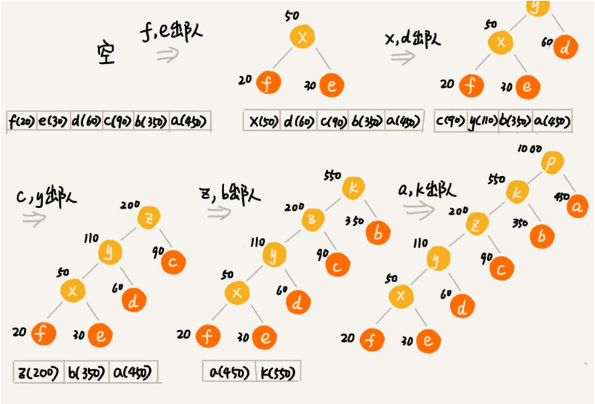
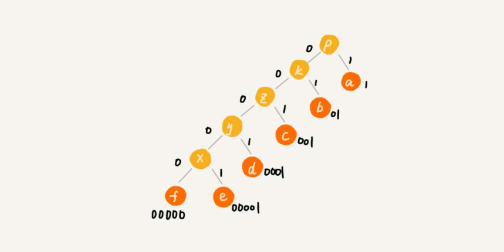

### 贪心算法

1. 当我们看到这类问题的时候，首先要联想到贪心算法：针对一组数据，我们定义了限制值和期望值，希望从中选出几个数据，在满足限制的情况下，期望值最大。
2. 我们尝试看下这个问题是否可以用贪心算法解决：每次选择当前情况下，在对限制值同等贡献量的情况下，对期望值贡献最大的数据
3. 我们举几个例子看下贪心算法产生的结果是否是最优的。大部分情况下，举几个例子验证就可以了。严格地证明贪心算大的正确性，是非常复杂的，需要涉及比较多的数学推理。而且，从实践的角度来说，大部分能用贪心算法解决的问题，贪心算法的正确性是显而易见的，也不需要严格的数学推导证明。

###### Prim和Kruskal最小生成树算法

###### Dijktra单源最短路径算法

###### 霍夫曼编码

* 一种非常有效的编码方法，广泛用于数据压缩中，其压缩率通常在20%~90%之间
* 不仅会考察文本中有多少个不同字符，还会考察么每个字符出现的频率，根据频率的不同，选择不同长度的编码。霍夫曼编码视图用这种不等长的编码方法，来进一步增加压缩的效率。
* 根据贪心的思想，将出现频率比较多的字符，用稍微点一些的编码；出现频率比较多的字符，用稍微短一些的编码；出现频率比较的少的字符，用稍微长一些的编码
* 为了避免解压缩过程中的歧义，霍夫曼编码要求各个字符编码之间，不会出现某个编码是另一个编码前缀的情况

如何根据字符出现的频率的不同，给不同的字符进行不同长度的编码？

* 将字符看作一个节点，并且附带着把频率放到优先级队列中

* 从队列中取出频率最小的两个节点A、B，然后新建一个节点C，把频率设置为两个节点的频率之和，并把这个新节点C作为节点A、B的父节点。最后再把C节点放入到优先级队列中。重复这个过程，直到队列中没有数据。

  

* 然后给每一条边画上一个权值，指向左子节点的边统统标记为0，指向右子节点的边，标记为1，那从根节点到叶节点的路径就是叶节点对应字符的霍夫曼编码

  